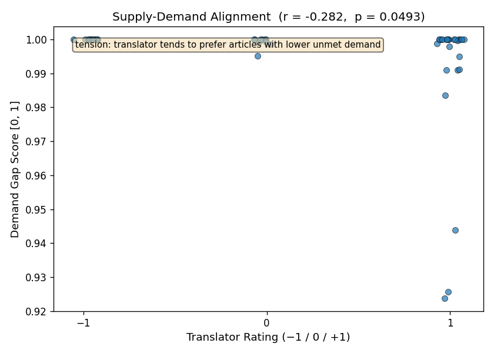
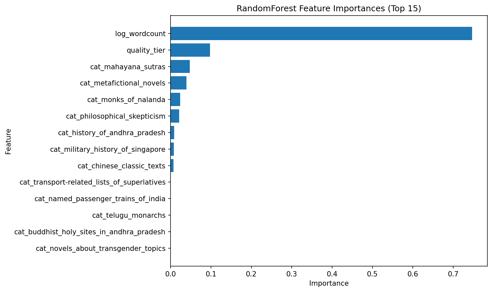
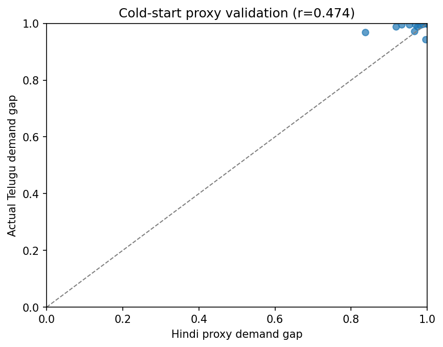

 on [Unsplash](https://unsplash.com/photos/an-open-book-sitting-on-top-of-a-table-pT4Cot62pE4?utm_source=unsplash&utm_medium=referral&utm_content=creditCopyText)](./english-tamil-dict-small.jpg){#fig-hero fig-align="center"}

_This is the final term project I did towards the completion of my [Master of Science in Analytics](https://www.analytics.gatech.edu) degree from Georgia Institute of Technology._

## Problem Statement[^1]

[^1]: With tongue firmly in cheek, the title makes a pun to not just the Multi-Armed Bandit problem, but also to Gayatri Chakravorty Spivak's seminal essay, *Can the Subaltern Speak?* [@Spivak1988]. In that piece, Spivak famously questioned whether subalterns - colonial populations excluded from hierarchies of power - could express their native thought / reasoning without conforming to Western ways.

Whilst multi-lingual anglophone writers may easily find a large readership for their writing in English, they often find it hard to find a ready audience for their writings in other vernacular languages. This is particularly so if they have very niche or domain-specific interests that may not have equivalent readership across language communities. And indeed, a sufficiently large readership is a crucial signal to motivate writers to write more, especially if they would like to practise or improve their writing talent.

Wikipedia translation offers perhaps the most accessible medium for such writers. In this sense, we see Wikipedia as a platform that connects interested writers and readers across a hidden dimension, that of language. But the difficulty for a sufficiently motivated writer is to find articles that are at the intersection of their own interests and what reasonably large number of readers would read. We explore Wikipedia as a two-sided market balancing the demand-side (readership, as measured in page-views) and the supply-side (translator interest or effort).

Put simply, the question we ask ourselves is this: how can we create a recommendation model that works similar to that on TikTok or Instagram Reels, but for *volunteer translators on Wikipedia*?

To this end, we have implemented a model that recommends articles for an interested translator using an explore-exploit approach ("The Multi-Armed Bandit problem"). The model balances the translator's own interest whilst optimising for readership potential. In a later section, we will share a brief literature review on this problem (@sec-lit-survey), and why the approach is unique both in its application to the problem area (motivating translators) and in its technical implementation.

We executed this model using Telugu Wikipedia as a primary case study, a language with 80 million native speakers yet dramatically underserved relative to comparable language communities.

We had previously proposed a detailed pipeline (@sec-pipeline) - from seeding interest by a translator to expanding, filtering, scoring, clustering and eventually recommending articles in the English Wikipedia back to them. In this report, we will not only elaborate on that pipeline, but also discuss nuances in implementation: how the problem was broken down into 9 JIRA-style epics with associated user-stories, how we optimized processing time for data gathering by a factor of 8 through parallelisation and batch API's, and so on. We will evaluate the implementation both from a quantitative perspective - by considering MAE's across a range of approaches - and a qualitative evaluation of the categories chosen. We will finally recommend a set of actions in the final section on how this framework can be taken forward.

## Literature Survey & Novelty {#sec-lit-survey}

Silva et al [-@silva2022] have observed that recommendation systems have "attracted a lot of attention from both industry and academia" as a response to exponential growth of digital information, which had led to "stressful situation\[s\]" of information overload for many users, particularly when comes to purchase decisions. Indeed, a lot of the effort has been towards recommending videos and such on Netflix [@ko2022a], and of course, TikTok, which, Zhang et al [-@zhang2021] have found, to be "impressive" in not just improving loyalty from users, but also drawing them "into new intersecting areas".

Silva et al's [-@silva2022] systematic literature review found 230 articles on Google Scholar published between 2000 and 2020 that used the Multi-Armed Bandit approach to develop recommendation systems. The field has had a growing interest in recent years; they found that more than 50% of such works were published between 2016 and 2020. Most applications, however, deal with recommending news, users' purchases (e.g. on Amazon),songs, advertisements, points-of-interest, bookmarks, food, jobs, and even jokes. None of the papers in their meta-analysis dealt with recommending articles to be translated.

Wulczyn et al's three-month study did generate a model to recommend articles for translators to translate from English to French Wikipedia. However, it did so by ranking articles that it deemed "missing" (and then matched translators to them) [-@wulczyn2016]. The starting point wasn't necessarily the translator's own interest, but achieving a certain completeness in the French Wikipedia compared to that in English. Translators in the study had raised questions of "language imperialism", as Wulcyzn et al themselves had documented.

In comparison, our approach is centered on the Telugu Wikipedia and on the personal: the goal isn't necessarily for the Telugu Wikipedia to reach parity, so to speak, with the English Wikipedia in terms of articles. Instead, the focus is essentially writer's own interest first: on what they would like to see in the Telugu Wikipedia primarily, whilst maximizing for readership.

## Methodology

### Overview {#sec-pipeline}

We proposed the pipeline in our project proposal seen in @fig-pipeline.

{#fig-pipeline width="600"}

The pipeline was implemented largely as proposed using the Agile methodology, as Epics with self-contained user-stories. This project was essentially done beyond work-hours and on weekend afternoons. As such, we needed a way to break the overall task down into small chunks (that can be executed over lunch for example), while at the same time, have assured code quality when we integrated it all. Having self-contained unit-tests per user-story helped us tremendously in this regard.

Some optimisations were later found necessary for data gathering and processing.

### Epic 1: Project Scaffolding

We used the Agile methodology to breakdown the pipeline into a series of epics and JIRA-style user-stories to be implemented sequentially. Each user-story had its own set of self-contained unit-tests. The overall project has a `pyproject.toml` file declaring all dependencies and a `config.yaml` to store values for `alpha`, `curated_categories`, `traversal_depth`, `quality_filter_threshold`, `epsilon`, `cold_start_window_days`

### Epic 2: Data Acquisition {#sec-data-sources}

We combined manual ratings with openly available data from various Wikipedia API's:

+----------------+------------------------------------------+-----------------------------+
| Source         | Signal Type                              | Feature                     |
+================+==========================================+=============================+
| Manual Ratings | Supply side "seed"                       | Translator interest rating  |
+----------------+------------------------------------------+-----------------------------+
| MediaWiki API  | Relevance (Features for Step #2: Expand) | Article categories          |
+----------------+------------------------------------------+-----------------------------+
| MediaWiki API  | Feasibility features                     | Article length (word count) |
+----------------+------------------------------------------+-----------------------------+
| MediaWiki API  | Feasibility features                     | Article quality rating      |
+----------------+------------------------------------------+-----------------------------+
| Pageviews API  | Reader demand                            | Demand gap score            |
+----------------+------------------------------------------+-----------------------------+

: Data Sources & Feature Set

#### Optimisations

Our initial versions for client-classes for MediaWiki and Pageviews API's called each Wikipedia article individually. In later stages, we realized that meant calling the API more than 2000 times in quick succession, especially if the constructed candidate pool was large. With enough throttling, that meant processing times of more than 45 minutes each time a candidate pool was constructed. Instead, we implemented the following:

1.  **Batch Processing**: We combined calls for multiple Wikipedia pages together into a single call. The API allowed up to 50 pages to be batched together
2.  **Parallel Processing:** We parallelized API calls into multiple threads using `ThreadPoolExecutor`.
3.  **Throttling:** Should an API call encounter a 429 error, we spaced out subsequent re-try attempts based on the message.

### Epic 3: Candidate Pool Construction {#sec-candidate-pool}

The candidate pool was constructed through the following inputs:

1.  **Seed Articles:** The user would suggest a list of 10-15 Wikipedia articles to seed the model first. In the final evaluation, we seeded the following articles:

    +------------------------------------+------------------------------------------------+
    | -   Caitika                        | -   List of tallest buildings in India         |
    | -   1915 Singapore Mutiny          | -   Longest train services of Indian Railways  |
    | -   Ngogo chimpanzee war           | -   Johor Bahru–Singapore Rapid Transit System |
    | -   Longest flights                | -   Montreal                                   |
    | -   Westray to Papa Westray flight | -   Quebec                                     |
    | -   Boat Mail Express              | -   Montréal–Trudeau International Airport     |
    | -   Shangri-La                     | -   Orlando: A Biography                       |
    | -   Tea Horse Road                 |                                                |
    +------------------------------------+------------------------------------------------+

    : Seed Articles for the Final Evaluation

2.  **Categories:** Querying the full English Wikipedia corpus of over 7 million articles is not just computationally infeasible, but semantically unfocussed. Therefore, we constrained the candidate pool of articles to a curated set of top-level Wikipedia categories specified by the user. This was defined in `config.yaml`

    We seeded the following categories in the final evaluation:

    +---------------------------------------------+-------------------------------------------+
    | -   Transport-related lists of superlatives | -   Novels about transgender topics       |
    | -   Military history of Singapore           | -   Metafictional novels                  |
    | -   Named passenger trains of India         | -   History of Andhra Pradesh             |
    | -   Mahayana sutras                         | -   Chinese classic texts                 |
    | -   Monks of Nalanda                        | -   Buddhist holy sites in Andhra Pradesh |
    | -   Telugu monarchs                         | -   Philosophical skepticism              |
    +---------------------------------------------+-------------------------------------------+

    : Categories for the Final Evaluation

3.  **Depth of Category Traversal:** The level to which the categories may be traversed can be set in `config.yaml` We initially tested the model with `1`, but executed it with `2`.

### Epic 4: Feature Engineering

The raw data collected in the previous epic is to be transformed it into model inputs here, through the following features:

#### 1. Article Quality Rating

Per Wikimedia's own guidance, articles in the English Wikipedia can be ranked using the following quality classes in order of quality: FA, GA, B, C, START, and STUB [@Johnson_Aragón_2022]. Other language Wikipedias also have their own quality classifications, even if they may not exactly match those in English.

We grouped all quality classes into three tiers, as follows:

| Tier         | Classes     | Encoded Value |
|--------------|-------------|---------------|
| High quality | FA, A, GA   | 3             |
| Mid quality  | B, C        | 2             |
| Low quality  | Start, Stub | 1             |

: Quality Classes in English Wikipedia grouped into three tiers

All articles in low quality (`encoded value = 1`) were excluded from the candidate pool entirely before scoring.

#### 2. Article Length

MediaWiki API returns a `wordcount`, which was used to signify length of an article. However, because the range of length of articles can be very wide indeed, we normalized this metric through a log transformation (`log(wordcount)`). In general, the difference in translation effort between a 500 and 1000 word article is much more significant than that between a 9,500 word and a 10,000 word article. A log transformation would naturally account for this and compress skewness in article length distribution.

#### 3. Category Membership

Whilst we curated the list of top-level categories to a limited set, Wikipedia articles are still classified under multiple categories. This can be challenging in encoding the information, which we have addressed in the following manner.

If $k$ is the number of curated top-level categories, each article would have: $$ category_i = \begin{cases}
\text{1}, & \text{if article belongs to category i} \\
\text{0}, & \text{if it doesn't}
\end{cases}$$ where $i = 1, 2, .... k$

This gave us a sparse binary vector per article. We can avoid the curse of dimensionality because we are manually curating less than 15 top-level categories, thus ensuring $k$ is small and fixed.

#### 4. Demand Gap Score

Whilst the features thus far *describe* a Wikipedia article, we also would like some demand-side signals. To this end, we used a a **demand gap score** to measure is how different readership is for the same page between the English and Telugu Wikipedia. The feature is derived from PageViews API as $$\text{Demand Gap Score}=1-\frac{\text{Telugu views}}{\text{English views}} $$

This provides a normalized measure of unmet readership demand that is comparable across articles of varying popularity.

#### 5. Cold-Start Gap

Whilst we can calculate a demand gap score between versions in English and Telugu Wikipedia, there is a possibility that a Telugu version may not exist at all (i.e., $\text{Telugu views} = 0$) In such a case, demand gap score will be 1 (undefined) for every untranslated article.

Which is to say, we may have a *cold start problem* - we will not gather sufficient pageview data for translated articles until well after the translations have been written. In such cases, we would use views for the Hindi language versions as a proxy instead:

$$\text{Cold Start Proxy} = 1 - \frac{\text{Hindi views}}{\text{English views}}$$

We chose Hindi as a proxy because we have seen that Hindi readership for the Wikipedia page on the Indian city Hyderabad (where both Hindi and Telugu are spoken) was 3-4 times that of the Telugu readership.[@langview] There is a very good chance that Hindi and Telugu readers may have overlapping topical interests for culturally proximate subjects: indeed, in many cases, they may be the same individuals as well, as many are fluent in both languages. Once sufficient Telugu pageview data has accumulated following the 3-month window, the model will transition back to the standard demand gap score.

This is naturally a hypothesis; it was evaluated independently in a later section. However, we took care to build this as a feature in this epic itself.

We also defined the following guardrails that can be set in `config.yaml`:

1.  Small constant guarding against division by zero in demand gap score: `epsilon: 1.0e-6`
2.  Days after a translation before switching from Hindi cold-start proxy to real Telugu views: `cold_start_window_days: 90`

#### Epic 3 & 4 Output

An output Excel was generated at the end of executing all the stories here with a constructed candidate pool expanding on the seed articles and categories with the features listed above, whilst filtering out low-quality articles. The pool is now ready for a translator to rate. In the final execution, 78 articles were retrieved.

### Epic 5: Scoring Model

#### Translator Rating

This "supply-side" feature, that of translator's own interest, is captured on a scale of three, roughly on par with swiping left or right as one does on some contemporary apps: **-1** (*dislike*), **0** (*neutral*) or **+1** (*like*).

In the final execution, 29 out of the 78 retrieved articles were rated either -1, 0, or 1.

#### Target Variable: Composite Score

We first normalized the translator's ratings to ${0, 0.5, 1}$ and then combined them with the demand gap score into a composite score:

$$\text{Composite Score} = \alpha \cdot \frac{\text{Translator Rating}+1}{2} + (1-\alpha)\cdot\text{Demand Gap Score}$$

where the coefficient $\alpha \in [0,1]$ was tuned through cross-validation.

#### Models: Baseline and Primary

We generated models that tried to learn the relationship between input features such as article length, quality tier etc and the target variable, composite score. The models will then be able to predict scores for articles that had not been evaluated as yet.

We compared three models:

-   **Naive Baseline**: Demand gap score used directly as predicted composite score
-   **Linear Regression**: This was meant to be a *baseline model* as we need a continuous variable to rank articles. Linear regression's simplicity and interpretability via coefficients make it a natural reference point against which to measure the added value of more complex models. The model was preprocessed with continous variables standardized (with zero mean, unit variance), while binary category flags were left unscaled.
-   **Random Forest**: This was meant to be a *primary model*, as it can capture non-linear relationships between features and the composite score, which is something that linear regression cannot do. Random Forest is also useful for understanding feature importance. No scaling required here.

We will discuss the results later in @sec-eval.

### Epic 6: Clustering (Topical Diversity)

#### Purpose

A scoring model that ranks articles by composite score alone is not sufficient for diversity. Without clustering, the recommendations could easily collapse into a single high-scoring topic cluster. Such an outcome would defeat the purpose of a personalized recommender and will accelerate translator burnout. Instead, to ensure topical variability, we performed clustering as a diversity mechanism, sampling top candidates from each cluster, rather than take just the global top N by score.

#### Choice of Algorithm

We used spectral clustering to cluster the articles by topic. The articles may share multiple category flags out of the 10-15 curated top-level categories, that is to say they are likely to have sparse binary vectors for categories. Consequently, while the articles are topically related, their relationship is geometric in a non-Euclidean sense. Connectivity-based similarity is better handled by spectral clustering than k-means.

The number of clusters $k$ is determined by the eigenvalue gap: we examined the eigenvalues of the graph Laplacian and choose $k$ where there's a natural gap between the $k$-th and $(k+1)$-th eigenvalue. The eigenvalue structure of the similarity matrix tells us how many natural topic communities exist in the article graph.

#### Feature Choice

Since the purpose of clustering is topical diversity rather than quality filtering, we excluded score and length features, and used category flags alone for clustering. This is to ensure that clusters reflect topical neighbourhoods and not quality or length neighbourhoods.

### Epic 7: Recommendation Through Explore-Exploit

#### *Takkari Donga*: The Multi-Armed Bandit

With articles scored by interest and opportunity, and clustered by topic, we know what a translator's preferences are, which are primed to be *exploited*. However, we also need to *explore* new territory to learn more about their preferences, a problem known as the Multi-Armed Bandit problem in reinforcement learning. Since we are dealing with the Telugu Wikipedia after all, one might call this the *Takkari Donga* problem[^2]: how does the clever bandit (in Telugu) explore and exploit learned preferences and opportunities for the motivated translator?

[^2]: *Takkari Donga,* or the clever bandit, is also as a reference to much forgotten Telugu belter from early 2000's where the singer celebrates the fact that he finds success going off the beaten path.

A key element here is to model distribution of reader interest across topic clusters, that is to say, to ask where the latent demand is concentrated. Density estimation via Gaussian Mixture Model (GMM) was a likely approach: if GMM flagged an article as sitting in a sparse, uncertain region, that article is worth exploring. This is not to say that the translator will necessarily *like* the article, but that the user's rating will give the most *new information* to improve the model. Consequently, a recommendation list would be a shortlist balancing exploit (articles with high composite scores) and explore (sparse GMM regions): the clever thief takes not just what is of high value, but also explores what *could be* of high value.

#### Recommendation Logic

The recommendation logic per cluster, can simply be stated as follows:

1.  We take all scored, clustered unrated candidates
2.  We fit GMM on feature vectors of already-rated articles
3.  We then compute the log-likelihood of each candidate under GMM
4.  **Exploit:** Within each cluster, we sort articles in *descending order* of composite score, taking the top 1 as an exploit candidate
5.  **Explore:** Within each cluster, we sort articles in *ascending order* of log-likelihood, taking the top 1 as an explore candidate
6.  We surface two such articles per cluster as recommendations. The total recommendations offered to the translator, therefore, would be $2k$ articles, where $k$ is the number of clusters. The translator's ratings on these recommendations then feed into the feedback loop, updating the model for the next round.

#### Epic 7 Output

An eigenvalue-gap plot using spectral clustering was generated. Having fitted a Gaussian Mixture Model, we generated 1 exploit (highest composite score) and 1 explore (lowest GMM log-likelihood).

### Epic 8: Take Feedback

#### Feedback Loop

Once recommendations are made, ratings given and the translations done, the model was intended to have a feedback loop with the following elements:

1.  **When an update is triggered:** The model will need to learn how readers have been taking to the translations. This would need sufficient time for organic readership to discover and engage with newly translated articles. To this end, we propose making updates every 3 months.

2.  **What gets updated:** We envisage a production update cadence as follows to give sufficient time for a model to learn:

    1.  **Continuous updates:** Each time new ratings are added
    2.  **Annual**: Retuning $\alpha$ every 12 months
    3.  **Biennial**: Retraining the full model

    This is obviously not possible within the term project cadence. But we simulated one manual update cycle using the author's own ratings.

## Results & Observations (Epic 9) {#sec-eval}

### Evaluation Premise

We measured Mean Absolute Error (MAE) between predicted and actual composite scores. MAE is appropriate here because it treats all errors equally, which is appropriate given that the composite score is bounded \[0,1\]. For a recommendation system where consistent ranking is more important than avoiding large errors, MAE is perhaps more appropriate than other error metrics such as Root Mean Squared Error (RMSE)

Our assumption was that we would arrive at the following evaluation hierarchy:

-   **Naive baseline**: As mentioned, we used demand gap score directly as a predicted composite score and measure its error against the computed composite score. This is equivalent to setting translator interest weight, $\alpha = 0$.
-   **Linear Regression**: MAE computed from model output and composite score via k-fold cross-validation
-   **Random Forest**: MAE computed against composite score via k-fold cross-validation.

Looking beyond MAE, feature importance scores from Random Forest could be examined to understand which signals drive recommendation quality most strongly.

**Recommendation Quality**

The model does more than predict scores, it produces a ranked list of recommendations. While we used MAE to tell us how well the model predicts scores, we will need to evaluate whether the ordering of recommendations is correct.

For such an evaluation, we first defined a threshold on the composite score. Given the range \[0,1\], we took the midpoint, 0.5, as the threshold. Articles above this score will be labelled as good candidates.

We then computed precision as the fraction of recommended articles exceeding this threshold, and compared this across naive baseline, Linear Regression and Random Forest.

**Single-user bias**

The approach would take a single user's (the author) preferences ("translator ratings") and build upon it, which could open up the chance that the translator's niche interests could diverge from mass readership.

We had earlier proposed exploring this through a simple diagnostic: we compute a correlation between translator ratings and pageview gap across recommended articles. This will lead us to two possible outcomes:

1.  **High Positive Correlation**: The model's two-sided approach is coherent: the translator's interests and reader demand are well-aligned.
2.  **Negative Correlation**: Such an outcome would reveal a genuine tension between supply and demand - the translator's niche interests diverge from mass readership. This is exactly the problem the model is designed to navigate (and therefore, the more interesting finding, academically speaking)

### Result 1: Supply Demand Tension

The model's core motivation - that there could be a genuine tension between a translator's interests from mass readership - may be validated. Pearson `r` between a translator's ratings and demand gap scores across rated articles calculates to `-0.282`, with a `p=0.049`.

{width="500"}

### Result 2: Evaluating Models

#### MAE

We expected Random Forest to have the least MAE followed by Linear Regression and Naive Baseline. Fascinatingly enough, that is **not** what we observed:

| Model            | Mean MAE | Std MAE |
|------------------|----------|---------|
| NaiveBaseline    | 0.202    | 0.122   |
| LinearRegression | 0.217    | 0.032   |
| RandomForest     | 0.216    | 0.042   |

: MAE by Model

-   **Very High Demand Gap:** In effect, we found that demand gap had essentially no variance, with a mean = 0.995, STD = 0.014 and the 50th percentile at 1. The candidate pool in retrospect was scoped to categories likely to be untranslated into Telugu; consequently, every article has near-zero Telugu views. This essentially meant the demand gap $d \approx 1.0$ everywhere.

-   **Model Ordering Failure**: The naive baseline here was the demand gap. When the demand gap is close to constant, it is trivially hard to beat.

-   **Precision\@0.5 = 1.000 for all models**: Essentially, `composite_score = demand_gap` $\approx 1.0 > 0.5$ for all articles.

-   **CV tuning returned** $\alpha = 0$: In effect, with near-constant demand gap, translator preference added no discriminating signal to the composite score on this dataset.

#### Feature Importance

We found `log_wordcount` to be of overwhelming importance compared with every other feature.

{width="500"}

### Result 3: Evaluating Cold Start Proxy

We computed a Pearson `r` between the Hindi proxy demand gap and actual Telugu demand gap on a separate set of articles. If `r> 0.7`, then the proxy would be justified.

We chose a list of generic Wikipedia articles that are likely to be available on both Hindi and Telugu Wikipedias:

| title           | hindi_proxy | actual_gap | abs_proxy_error |
|-----------------|-------------|------------|-----------------|
| Mahabharata     | 0.836706    | 0.967915   | 0.131209        |
| Shiva           | 0.917235    | 0.988801   | 0.071566        |
| Yoga            | 0.933242    | 0.995607   | 0.062365        |
| Telugu language | 0.995403    | 0.943378   | 0.052025        |
| India           | 0.952274    | 0.996127   | 0.043853        |
| Hinduism        | 0.968478    | 0.996320   | 0.027842        |
| Hyderabad       | 0.974165    | 0.989439   | 0.015274        |
| Turmeric        | 0.980290    | 0.994050   | 0.013760        |
| Rice            | 0.988496    | 0.997720   | 0.009223        |
| Andhra Pradesh  | 0.965983    | 0.973239   | 0.007257        |

: Evaluating Cold Start Proxy

At a computed `r=0.474, p=0.0040`, the choice of a proxy was **not** justified:

{width="500"}

### Result 4: GMM Exploit/ Explore Mechanism

We received the following set of recommendations from the GMM model:

+-----------------------------+------------+-------------------+--------------+------------+
| title                       | cluster_id | recommendation\_\ | composite\_\ | gmm_log\_\ |
|                             |            | type              | score        | likelihood |
+=============================+:==========:+:=================:+:============:+:==========:+
| Hopscotch (Cortázar novel)  | 0          | exploit           | 1.00         | 12.05      |
+-----------------------------+------------+-------------------+--------------+------------+
| The World According to Garp | 0          | explore           | 1.00         | -37.75     |
+-----------------------------+------------+-------------------+--------------+------------+
| Twenty-Four Histories       | 1          | exploit           | 1.00         | 12.54      |
+-----------------------------+------------+-------------------+--------------+------------+
| Vijayawada                  | 1          | explore           | 0.94         | 9.91       |
+-----------------------------+------------+-------------------+--------------+------------+
| Robert Brooke-Popham        | 2          | exploit           | 1.00         | 10.48      |
+-----------------------------+------------+-------------------+--------------+------------+
| Royal Malay Regiment        | 2          | explore           | 1.00         | 9.54       |
+-----------------------------+------------+-------------------+--------------+------------+
| John Tremayne Babington     | 3          | exploit           | 1.00         | 9.92       |
+-----------------------------+------------+-------------------+--------------+------------+
| Kalinga (region)            | 3          | explore           | 0.98         | 9.79       |
+-----------------------------+------------+-------------------+--------------+------------+
| Nüwa                        | 4          | exploit           | 1.00         | 9.52       |
+-----------------------------+------------+-------------------+--------------+------------+
| Michel de Montaigne         | 4          | explore           | 1.00         | 11.19      |
+-----------------------------+------------+-------------------+--------------+------------+
| Sextus Empiricus            | 5          | exploit           | 1.00         | 12.57      |
+-----------------------------+------------+-------------------+--------------+------------+
| Sarvepalli Radhakrishnan    | 5          | explore           | 0.92         | 11.52      |
+-----------------------------+------------+-------------------+--------------+------------+
| Laozi                       | 6          | exploit           | 1.00         | 9.98       |
+-----------------------------+------------+-------------------+--------------+------------+
| Lord Mountbatten            | 6          | explore           | 1.00         | 7.38       |
+-----------------------------+------------+-------------------+--------------+------------+
| Jizi                        | 7          | exploit           | 1.00         | 11.44      |
+-----------------------------+------------+-------------------+--------------+------------+
| Pierre Bayle                | 8          | exploit           | 1.00         | 13.16      |
+-----------------------------+------------+-------------------+--------------+------------+
| Rajahmundry                 | 8          | explore           | 0.93         | 10.64      |
+-----------------------------+------------+-------------------+--------------+------------+
| Trincomalee                 | 9          | exploit           | 0.99         | 11.52      |
+-----------------------------+------------+-------------------+--------------+------------+
| Malayan campaign            | 10         | exploit           | 1.00         | 11.48      |
+-----------------------------+------------+-------------------+--------------+------------+
| Mazu                        | 10         | explore           | 1.00         | 11.03      |
+-----------------------------+------------+-------------------+--------------+------------+

: Exploit/ Explore Results

The explore/ exploit distinction has partially collapsed here: several explore candidates have composite scores of 1. This is a consequence of what we saw earlier in Results 2: composite score has lost its discriminating power, even as GMM is doing the differentiation work alone.

It is also notable that *The World According to Garp* has a GMM value of -37.75. This is because it is the only article in the pool whose category, *Novels about transgender topics* appears in zero rated articles. This makes it genuinely maximally out-of-distribution for the GMM.

That being said, it is quite fascinating to see recommendations emerging from such a diverse set. Seeding Singapore history gave us Robert Brooke-Popham (a *British* Air Marshal), and the Malay Regiment for exploit and explore from Cluster 2. Likewise, we see Nüwa (a Chinese goddess) and Michel de Montaigne (a French philosopher) for exploit and explore from the same cluster, Cluster 4.

### Result 5: Clustering

Clustering resulted an extremely unbalanced set. While Cluster 0 has 53 out of 78 articles (68%), there were 42 disconnected components in 78 articles. This meant the category co-membership graph is very sparse. Effectively, topical diversity was largely undermined, making it one giant cluster and 11 micro-clusters.

This was an entirely unexpected result as we deliberately chose to seed our categories in a diverse manner. Further drilling down, we note that four of twelve curated categories - such as *Telugu monarchs* or *Buddhist holy sites in Andhra Pradesh* - contributed zero candidates after quality filtering. This is because English Wikipedia's coverage of these topics is predominantly at stub or start tier. What is utterly fascinating here is that this is **not** incidental: the same structural under-representation that motivates Telugu Wikipedia expansion is reproduced on the supply side. The quality filter, which was designed to source translatable articles, inadvertently maps the contours of the original problem.

In effect, our clever multi-armed bandit - the *takkari donga -* needs to operate in English as well as Telugu. We will not just need to find articles to translate *to* Telugu, we also would need to find articles a few degrees removed from Telugu culture in English Wikipedia and perhaps work towards improving their quality as well.

## Summary

In this paper, we have confirmed our core motivation: that there is a genuine tension between supply (articles in the English Wikipedia that a translator would like to translate) and demand (what gets read in Telugu Wikipedia). We have seen that the demand gap had collapsed in this evaluation - either interesting articles of high quality had no translations at all to Telugu, or that categories likely to be of interest to Telugu readers did not have high quality articles in English Wikipedia. The cold start proxy hypothesis - that we may use Hindi pageviews as a proxy for Telugu pageviews while Telugu pageviews build up - was not empirically justifiable.

### Next Steps

The code pipeline exists, and can be generated for any Wikipedia translator across any language pair. An immediate next step could be try the model out with more focussed categories or seed articles, whilst bearing in mind the quality of the articles. Other languages such as Kannada or Tamil could also be used as a cold start proxy.

Alternatively, replacing the language-proxy demand gap with a normalized quality tier score (`quality_tier/3.0)` provides a content-based signal that is immune to the pageview degeneracy problem. Indeed, doing so gives us the following fallback shortlist:

| title                    | cluster_id | composite_score |
|--------------------------|------------|-----------------|
| Zuo Zhuan                | 0          | 1.000000        |
| Vijayawada               | 1          | 0.943860        |
| Robert Brooke-Popham     | 2          | 0.666667        |
| Kalinga (region)         | 3          | 0.983580        |
| Michel de Montaigne      | 4          | 0.666667        |
| Sarvepalli Radhakrishnan | 5          | 0.923803        |
| Lord Mountbatten         | 6          | 0.999332        |
| Jizi                     | 7          | 0.666667        |
| Rajahmundry              | 8          | 0.925769        |
| Trincomalee              | 9          | 0.666667        |
| Malayan campaign         | 10         | 0.666667        |

: Fallback Shortlist

(Scores of 0.067 reflect `quality_tier = 2` normalized to 2/3, while 1 reflects `quality_tier = 3`)

### Conclusion

Whilst such tweaks can address some limitations in the model, to this multi-lingual writer, the problem perhaps is larger and must be seen across languages. The challenge here is not to bring English Wikipedia articles to Telugu Wikipedia, but to bring articles of interest to a Telugu-speaking milieu to *both* English and Telugu Wikipedias. *Takkari donga*, the clever multi-armed bandit, was multi-lingual all along. They need to write not just in Telugu, but in that other Indian language spoken and read widely, English.

## Bibliography