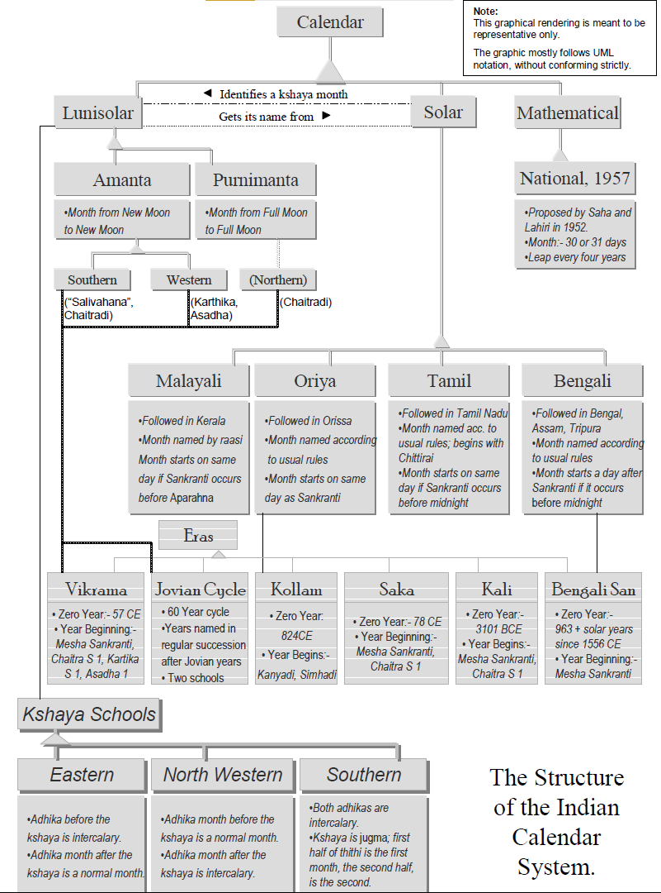

{#fig-kalachakra fig-align="left"}

## 0. Foreword

### 20th Anniversary Edition (2023)

This is a "20th anniversary edition" of a thesis I wrote in 2002 for the Undergraduate Research Opportunities Programme (UROP), as part of my mathematics minor in the National University of Singapore. This is also a word-for-word republishing of the thesis, but with updates to embed graphics and tables within the text. All errors (if any) are mine, and have existed for 20+ years.

For the longest time, this thesis was up on my then supervisor, Dr Helmer Aslaksen's website at the Mathematics Department's webpage. During this time, a great many had downloaded the PDF, but very few presumably understood it. For, this undergrad thesis found it its way to websites talking about dark magic and other related mystical concepts. Probably they got confused with the "tantra" in the title. Didn't help that I made this mystical-looking, but perfectly scientific, graphic alluding to kaala chakra's that would presumably sound woo-woo to unsuspecting audiences. Incidentally, I just re-did this graphic (@fig-kalachakra) to more exacting design standards, and perhaps would warrant another detailed explanation.

Dr Aslaksen returned to Oslo many many moons ago (pun intended). His old webpage at NUS' website was still active for many years later, but now that it too has gone, I'm now back on the Internet to say this: nothing tantric about it. I was just punning between the Sanskrit terms 'panchatantra' and 'panchangam'. In fact, this is all mathematic exploration and research, by way of Vedanga Jyotisa, Surya Siddhanta, and modelling all of those principles in Java and LISP. This is me doing that roots thing but via math. This is me claiming expertise in Indic, Chinese and Islamic calendars, of being able to tell when Chinese New Year and Deepavali can fall. Akshay researching kshaya months, if you will. That is all there is to it. Magical, but no black magic.

There is one literary conceit, though.

### Second Edition (2002)

The fable of Apara Ganita and the Mystical Garden of Enchanted Numbers is obviously fictional. The inspiration is *Leelavati Ganitam*, a chapter in the ancient mathematical treatise, the *Siddhanta Siromani*, written by Bhaskaracharya in 1150 CE. The *Leelavati Ganitam* is fascinating not only for its treatment of indeterminate analysis and a method to solve Pell's Equation, but also, as a Canadian university's website on mathematical history puts it[@simonfraser], for its poetic conversation between the narrator and a narratee named Leelavati. The similarity between this poetic construct and the conversation between Apara Ganita and the dwara palika is probably noticeable.

Frame stories are not common for scientific research papers, but they certainly have a historical precedent.

## 1. *Prologue*: The Mystical Garden of Enchanted Numbers

*Once upon a time, in the magical mystical city of Suvarnapuri*[^1], there lived a student called Apara Ganita[^2]. Apara Ganita was virtuous and devoted to his sciences. Having spent considerable amount of time learning the shastras from his guru, he was surprised when one day his guru called him up. "You have performed well, O sishya⁴ mine", the guru said, "but the time has now come for you to take leave".

[^1]: *Suvrnapuri* = City of Gold

[^2]: *Apara Ganita* = One with a lot of mathematical talent.

*Apara Ganita was at once sad, for he had learned a lot under him. But he remained quiet and continued listening to his guru.*

*"Listen, Apara Ganita, I shall now tell you something that my guru told me when I finished my studies. For, a study in Ganita Sastra (mathematics) is not complete, unless one visits the Mystical Garden of Enchanted Numbers"*

*"You must go and find this place for your education to be truly complete".*

*And so Apara Ganita went about searching for this place. Indeed, after much travelling and searching, he was finally shown the way to the Mystical Garden of Enchanted Numbers.*

*And lo, what a beautiful sight it was! For it was situated in the midst of a lush green valley, saddled by mountains on either side. Down there, Apara Ganita could see famous mathematicians expositing their theories and skills, like hawkers on a bazaar street. There was Euclid standing on a rectangle, explaining the beauty of the Golden Ratio in classic Greco Caldean architecture. Pythagoras was standing next to him as a part of the Greek exhibit, explaining the virtues of a right-angled triangle to a curious crowd. From the far end of the Orator's Corner, Zhao Jun Qing looked at Pythagoras and smiled. He was himself holding a right-angled triangle and was explaining his proof for the Pythagoras' Theorem. Mandelbrot was decorating the Garden with flowers of fractallate beauty. John Nash was close by; he was pointing at a group of women, probably explaining game theory to onlookers around him. In another corner of the garden, (Sector 1729), Srinivasa Ramanujan was vociferously arguing a point with Thomas Hardy.*

*It was such an environment that Apara Ganita wanted to enter.*

*However, as he was about to enter through the great doors guarding the garden, he heard a sonorous voice calling out his name.*

*He stopped and turned around to see who was calling him only to saw a young woman coming towards him. With eyes burning with curiosity and a voice sweeter than a nightingale, she said:*

|   O Student Erudite,
|   What is it that you study tonight?

*Just what I needed, a mystical* dwara palika *(female door keeper), he said to himself. Shaking his head in wry amusement, he looks at the books in his hand and takes a deep breath to begin his dissertation.*

## 2. *Sthaana Prakarana*: How the calendar is different in different regions

| *In a sonorous voice, the dwara palika said,*
|       In order to ascertain your dissertation's veracity,
|       can I hear you talk about the calendar's regional complexity?
| *To which Apara Ganita listened to the multitudes of voices in the Garden, and replied thus:*

Probably the easiest way to classify Indian calendars is by the region of usage. It must be reiterated though, that such an exercise might be misleading. The classification is indeed not watertight; all calendars are intrinsically inter-linked with one another. A flowchart of the various Indian calendars and the links between them can be seen below (@fig-caluml).

{#fig-caluml fig-align="left"}

With this caveat, we'll now traverse India on a calendrical vehicle of sorts. In particular, we try to ascertain the following elements in each region's calendrical practices: - \* Basis of the Calendar \* Local Variation \* When does the year begin? \* Era Followed

We'll find the following calendars defined with these metrics: -

### 2.1 The Southern Amaanta Calendar

The Southern Amaanta Lunisolar Calendar is predominantly followed in the South and South-West Indian states of Andhra Pradesh, Karnataka and Maharashtra. It is essentially a lunisolar one; i.e., its days and months are calculated based on the motions of the moon. Like the Chinese calendar, the month is calculated from new moon to new moon. It however, differs from the Chinese calendar in that the lunar day ("*thithi*") of the new moon is considered the last day of the previous month. Again, as in the Chinese calendar, a leap month, an *adhika maasa*, is added to the calendar every 2.7 years on an average to offset the disparity in lengths between the lunar year and the sidereal year. In addition, a month, the *kshaya maasa*, is occasionally subtracted. This is discussed in a later segment.

The Southern Amaanta Calendar differs from the Western Amaanta Calendar in its treatment of *kshaya maasas*, the New Year Day and the Era followed. We believe that the Southern Amaanta Calendar follows the Southern School for treating kshaya maasas. Saha and Lahiri suggest that it follows the Salivahana Saka Era starting with Chaitra Sukla Pratipada [@chakravarty1985indian, pp. 304], the lunar day after the last new moon before *Mesha Sankranti*. The years are also named according to the names of the Jovian years (Southern School [@saha1992report, pp. 270]). The Eras and handling of *kshaya maasas* will be discussed in detail in their respective segments.

### 2.2 Western Amaanta Calendar

As already mentioned, we believe it's important to distinguish between the Amaanta calendar practised in South and West India. In West India, specifically, in the state of Gujarat, the Amaanta calendar is of two forms[@chakravarty1985indian, pp. 304], one that starts with Aashaadha (followed in the Kathiawar region) and one that starts with Kartika (followed all throughout Gujarat). Both calendars follow the Vikrama Era and both also possibly follow the North Western School for *kshaya* months.

### 2.3 Purnimaanta Calendar

The Purnimaanta Calendar is followed in most of North India, i.e., in the states of Bihar, Himachal Pradesh, Uttar Pradesh, Haryana, Punjab, Jammu and Kashmir and Rajasthan [@chatterjee1988indian, pp. 42]. (Earlier literature fails to mention Uttaranchal, Chattisgarh, Jharkhand and Delhi, but they are off-shots of bigger states and would necessarily follow the same calendar). The last of the three Indian lunisolar calendars, this one differs from the Amaanta calendar in that the months are reckoned from full moon to full moon. Therefore, the Purnimaanta calendar starts two weeks before the Amaanta calendar does; that is, it starts with the lunar day after the last full-moon before Mesha Sankranti. The Vikrama Era is followed [@chakravarty1985indian, pp. 305], along with the Northern School of Jovian-year names [@saha1992report, pp. 270].

### 2.5 The Malayali Calendar

We now come to the list of Solar Calendars. The Malayali Calendar is predominantly followed in the South Indian state of Kerala. It is essentially a solar calendar; as we shall see later, the months are defined according to the raasis. The year starts with the Simha Sankranti and follows the Kollam Era.[@chakravarty1985indian, pp. 304] The month begins on the same day as a Sankranti if it occurs before aparahna, i.e., three-fifths of a day. Otherwise, it begins on the next day.

### 2.6 Tamil Calendar

The Tamil calendar is followed in Tamil Nadu. This calendar is also solar; the month begins on the same day as a Sankranti if it occurs before sunset [@chatterjee1988indian, pp. 14]. The Kali Era is followed along with the Southern Jovian cycle. One peculiarity about the Tamil calendar is that its month names start with Chittirai[@chatterjee1988indian, pp. 9] (Chaitra).

### 2.7 Bengali Calendar

The Bengali calendar is predominantly followed in West Bengal, Assam and Tripura. The Era is the Bengali San. The rule for the beginning of the month is again different; the month begins on the day after a Sankranti, if it occurs before midnight. Otherwise, it begins on the third day. [@chatterjee1988indian, pp. 14]

### 2.8 Oriya Calendar

The Oriya calendar is followed in the Eastern state of Orissa. In addition to the Bengali San, the Saka, Vilayati and Amli eras are followed. [@saha1992report, pp. 258] The month begins on the same day as that of the respective Sankranti. [@chatterjee1988indian, pp. 14]

### 2.9 The Nanakshahi Calendar

Promulgated in 1998 CE, the Nanakshahi Calendar is followed in Punjab. It's intrinsically linked to the Gregorian calendar, except in its usage of the Nanakshahi Era.[@purewal]

### 2.10 National Calendar of 1957

Proposed by the Calendar Reform Committee of 1952 and promulgated in 1957 CE, the National Calendar is a tropical calendar with fixed lengths of days and months. However, because it was totally different from the traditional calendars, it did not find much acceptance. [@chatterjee1988indian, pp. 18]

We may thus summarize Indian calendars thus:

```{python}
#| echo: false
#| label: tbl-indian-calendars
#| tbl-cap: Various Indic Calendars
from IPython.display import Markdown
from tabulate import tabulate
import pandas as pd

def read_from_csv_and_display_as_markdown(filename, headers):
    df = pd.read_csv(filename)
    #replace nans as empty string
    df = df.fillna('')
    return Markdown(tabulate(
        df, 
        headers=headers
    ))

read_from_csv_and_display_as_markdown('IndianStates.csv', ['State', 'Calendar', 'Era', 'New Year', 'Further Local Variation'])
```

Do note that: 1. The table is not exhaustive terms of calendars nor in terms of states. Among others, Arunachal Pradesh, Manipur, Meghalaya, Mizoram, Nagaland and Sikkim were left out. 2. Chatterjee mentions that the Orissa School for deciding the beginning of the solar month is also used in Punjab and Haryana "where the solar calendar is also used". [@chatterjee1988indian, pp. 14]

## 3. *Maasa Naamakarana*: How the Months got their Names.

| *Listening to this, she said,*
|       Since we are deep in this game,
|       Might I ask how each month got its name?
| *To which Apara Ganita stared at a gulmohar flower with twenty-seven buds and replied thus:*

The complexity of the Indian calendar system is not just in the plethora of calendars available, but also in the manner in which they link up with one another. A principal point of linkage of most Indian calendars is in their names of the months; as we shall see, the similar sets of month names are used in more than one calendar. In this section, we aim to formulate rules determining the naming of the months. Our motivation is not just taxonomic; month names, we shall see, are critical to understanding the Indian calendar system.

We propose that there are two types of month names: -

### 3.1 Months named after Nakshatras

The set of month names named after *nakshatras* is used by both solar and lunisolar calendars, adding to seeming complexity of the Indian calendar system. Indeed, as we shall see, this type should actually called as 'Months *initially* named after *Nakshatras*'; there has been an infusion of solar rules into an essentially lunar convention.

Let us then, first consider the original rule. Saha and Lahiri mention that pakshas or fortnights were differentiated based on the nakshatra "where the moon is full".[@saha1992report, pp. 221] That is to say, if a particular full moon occurs near, say, the lunar asterism, Visakha, the full moon would be called as Vaisakha Purnimaasi, and the month would be Vaisakha. The earliest lunisolar months, then, were purnimaanta, that is, the name of the full moon corresponded to the name of the month. Of course, the full moon occurs at all nakshatras. Fifteen were taken into account for naming of the month, spaced more or less equally.

We thus have the following set of names along with their respective nakshatras[@saha1992report, pp. 221]:

```{python}
#| echo: false
#| label: tbl-nakshatra-months
#| tbl-cap: Nakshtras and Months

read_from_csv_and_display_as_markdown('Nakshatras.csv', ['Nakshatra on Purnima', 'Month Name'])
```

It may be noted that the months of *Aashaadha*, *Bhadrapada* and *Phalguna* are linked to two *nakshatras* respectively. Chatterjee and Chakravarthy give the following criteria for choosing *nakshatras* for month names[@chakravarty1985indian, pp. 281]:

1.  The yogataaras or the identifying stars of the nakshatras are prominent or have traditional significance.
2.  They are spaced equidistant from one another.

It must be mentioned that this rule is now an approximation largely due to Earth's precession; for instance, this year's Chitra Purnimaasi had Swati as its nakshatra. Also, possibly for historical reasons, and allowing for regional variation in pronunciation, the Oriya, Bengali, Assamese, Punjabi and Tamil solar calendars also use the same set of month names.

To reconcile all this, we might frame a new rule, that, the amaanta lunar month takes its number from the solar month that starts in it, but its name from the solar month in which it starts, while following the purnimaanta months in chronological order. That is to say, since Chitra occurred during the purnima of this year's first purnimaanta month, we call this month as 'Chaitra'. Consequently, the first amaanta month would also be 'Chaitra', which also would be the name of the solar month during which the amaanta 'Chaitra' started. However, the 'number' of the solar month ('1' in the case of amaanta and purnimaanta Chaitra) is not quite the same; the solar Chaitra is the last (i.e., 12th) month of the year. The lunisolar Chaitra's number is taken by the solar month that begins in it, namely the solar Vaisakha. All this can be seen in the graphic in the next page.

The relationships for all the months may be mapped according to the following table [@chakravarty1985indian, pp. 280] (Punjabi month names [@purewal]):

```{python}
#| echo: false
#| label: tbl-month-relationships
#| tbl-cap: Raasis and Months in various parts of India

read_from_csv_and_display_as_markdown('Raasi and Months.csv', ["Raasi", "Approximate Nakshatra on Purnima", "Lunar Month Name", "Solar Month Name", "Assamese Version", "Tamil Version", "Punjabi Version"])
```

The Assamese, Punjabi and Tamil versions have been provided to give an idea of the linguistic variation. It is also interesting to observe that the National Calendar suggested by Saha and Lahiri also uses the same set of month names, increasing the potential confusion. As is probably obvious by now, the rule does not correspond to the Tamil, National and Nanakshahi calendars.

### 3.2 Months named after Raasis

Only solar months share their names with *raasis*. SK Chatterjee and Apurba Kumar Chakravarthy give the following names along with the associated *raasis*[@chakravarty1985indian, pp. 280]:

```{python}
#| echo: false
#| label: tbl-raasi-months
#| tbl-cap: Malayalam months named after *raasis*

read_from_csv_and_display_as_markdown('Malayalam Months.csv', ['Raasi', 'Sanskritised Version', 'Malayalam Version'])
```

That is to say, the month shares its name with that of its corresponding *Sankranti*. For instance, if *Mesha Sankranti* occurs on a certain day, then the period until the next *Sankranti* would be *Mesha maasa (Medham maasam)*.

This naming rule is followed primarily in the Malayalam calendar. Incidentally, Abhayankar says that the Oriya calendar also follows this rule. [@abhayankar1993debts, pp. 55]

## 4. *Parva Dina Nirnaya*: How the days of festivals are decided.

| *Hearing him speak, she asked,*
|       The cultural complexity is interesting,
|       but perhaps you have a festivals listing?
| *To which Apara Ganita looked at birds chirping and replied thus:*

We provide a list of Indian festivals, along with their (Indic) dates and the calendar used to reckon the particular festival. The list of festivals is by no means exhaustive; the entries are mostly public holidays in India.

```{python}
#| echo: false
#| label: tbl-indian-festivals
#| tbl-cap: Various Indic Festivals [@chatterjee1988indian, pp. 60-68]

read_from_csv_and_display_as_markdown('Festival Listing.csv', ['Festival', 'Indic Date', 'Additional Rules', 'Calendar Used'])
```

A bit of explanation is necessary. First, the terms. "*Nisita*" is defined to be a time- period measured by two *ghatikas* (1/60th of a solar day; approximately 20 minutes) stretching on either side of midnight. "*Pradosha*" is the time-period stretching for two *muhurtas* (1/15th of the time between sunrise and sunset; approximately 1 hour 36 minutes) after sunset. "*Madhyahna*" is one-third of the time-period between sunrise and sunset. This fraction covers mid-day.

Second, these dates are valid only on non-intercalary *thithis* for all lunisolar festivals. Both leap days and non-leap days in leap months are deemed unfit for festivals. (*Kshaya maasas* are not an issue here because a) *jugma* months are deemed fit for religious observance and b) in the Eastern and Northwestern schools, the extra intercalary month is deemed to be normal).

And finally, if the given *thithi* doesn't cover the given time, or covers the given time on two solar days, then the second solar day is reckoned to be the respective festival.

## 5. *Samvad Sandesha*: How Eras come into play

| *Perceiving the response, she questioned:*
|       I do not know if this is an important part,
|       but from when do all calendars start?
| *To which Apara Ganita looked at a foundation stone and replied thus:*

The Indian calendar system follows a wide range of eras, some of historical interest. Also, we do not attempt to link individual calendars to eras, for the same calendar may be reckoned with two different eras in two different places.

Here's the listing:

```{python}
#| echo: false
#| label: tbl-indian-eras
#| tbl-cap: Various Indic Eras [@saha1992report, pp. 252-258]

read_from_csv_and_display_as_markdown('Eras.csv', ['Era', 'Zero Year', 'Beginning of Era with respect to individual year'])
```

In addition, some regions also name their years according to the names of the Jovian years. Saha and Lahiri point out that there are two schools for this; the Southern school names its years in continuous succession, while the Northern school names its years corresponding to the present Jovian year. [@saha1992report, pp. 272]

## 6. *Kshaya Sutra*: How certain months are dropped

| *Observing the reaction, she enquired:*
|       To calendars you seem an active saakshya [^3],
|       but from when do all calendars start?
| *To which, Apara Ganita looked at some fallen leaves and replied thus:*

[^3]: *saakshya* = witness (in Sanskrit)

One of the most interesting aspects of the Indian lunisolar calendar is its *kshaya maasas*, literally "decayed months". Occasionally, certain months are dropped from the lunisolar calendar. We now try to understand the modalities behind this omission; we try to answer how, why, when and where it happens.

First, let us try to define a kshaya month. Chatterjee, in his work on Indian calendars, says that a certain lunar month "may completely overlap any of the short three nirayana solar months of Margasira, Pausha and Magha", with the result that there will be no new moon in the respective solar month. Consequently, there will be no lunar month named "after \[…\] this solar month". [@chatterjee1988indian, pp. 34] This interaction may be visualized in @fig-kalachakra.

We learn the following from this statement:  1. That the solar months of Margasira, Pausa and Magha are small, 2. That at a certain time, there might be no new moon in these months, and 3. The corresponding lunar month is dropped from the calendar.

Note that Chatterjee is silent on whether the dropped lunar month is amaanta or purnimaanta; a naïve assumption would be that since he talks about new moons, the month would be amaanta. But a study of the (Chaitradi) amaanta and purnimaanta calendars for the present year reveals that the difference between these two calendars is still two weeks. Therefore, it's safe to conclude that kshaya months were dropped from the purnimaanta calendar as well.

Moreover, the statement about "corresponding lunar month" is unclear; are we talking about the lunar month with the same number as the new-moon-lacking solar month? Or are we talking about the lunar month with the same name of the solar month? Running the *calendrica* code provided by Dershowitz and Reingold with their book *Calendrical Calculations - The Millenium Edition* (see table for values), we see that it is the lunar month with the same name that gets dropped.

To account for a purnimaanta kshaya, and to further clarify which month to drop, we re-phrase the definition of a kshaya month to be thus:

> "In any given lunar year, if two consecutive Sankrantis occur between two consecutive new moons, then the lunar month, whether amaanta or purnimaanta, with the same name as the solar month in which this occurs, is dropped."

As we shall see, such a re-phrasing is useful for computational purposes.

Indeed, as we mentioned earlier, we ran the Dershowitz and Reingold's calendrica package to get values for the occurrence of a kshaya month. Since searching for a kshaya month is computationally very heavy[@deshowitz2002calendar, pp. 24], we used a table prepared by Saha and Lahiri (table 22 in the book)[@saha1992report, pp. 250] as a starting point. We also tabulated results for non- kshaya months, specifically years with gaps of 19, 46, 65, 76, 122 and 141 years respectively. The results and the graphs from these results are tabulated in @tbl-kshaya-timings.

```{python}
#| echo: false

#read from 19631216 - 19830212 - kshaya.csv
kshaya = pd.read_csv("19631216 - 19830212 - kshaya.csv")
kshaya_old = pd.read_csv("kshaya-old.csv")
kshaya_union = pd.concat([kshaya, kshaya_old]).sort_values(["Gregorian (CE)"]).reset_index(drop=True)

#print all columns in kshaya
kshaya_small = kshaya_union[["Hindu Solar (Saka Era)", "Gregorian (CE)", "Hindu Lunar (Vikrama Era)", "Leap Month?", "Leap Day?", "Sankranti: hh:mm:ss", "Amavasya: hh:mm:ss"]]
```

It must be noted that all cases tabulated previously have been calculated according to Surya Siddhantic rules and that we may get a different set of results if calculated according to ephemeris calculations. Indeed, as Chatterjee has pointed out, there was a difference in 1964 CE; ephemeris calculations showed Margasira to be kshaya (and Karthika, Chaitra to be adhika), while as we've seen, Surya Siddhantic computation showed Pausa to be kshaya (and Asvina and Chaitra to be adhika) [@chatterjee1988indian, pp. 38] Chatterjee, however, seems to be in agreement with Dershowitz and Reingold in saying that there was a kshaya in Magha in 1983 CE [@deshowitz2001calendrical, pp. 269], despite his use of ephemeris calculations.

What do we get from all this? We see that a kshaya month can occur every 19, 46, 65, 76, 122 or 141 years. Indeed, Saha and Lahiri's tabulation provide us with the following frequencies of occurrences for gaps between kshaya months [@saha1992report, pp. 250]:

| Interval | Number of times occuring |
|----------|--------------------------|
| 19       | 11                       |
| 46       | 3                        |
| 65       | 1                        |
| 76       | 1                        |
| 122      | 1                        |
| 141      | 6                        |

: Number of times a particular interval gap occurred {#tbl-kshaya-gap}

We therefore see that between 525 CE and 1985 CE, kshaya occurred 11 times with a gap of 19 years, thrice with a gap of 46 years, six times with a gap of 141 years, and once each with gaps of 65, 76 and 122 years. The obvious question one would like to ask would be why. Why does kshaya occur only in these gaps?

To answer this better, we re-iterate what causes kshaya in the first place. We already said that a kshaya would occur when two consecutive Sankrantis occur between two Amavasyas. That is to say, when a solar month is shorter in length than, and is completely enclosed by, a (an Amaanta) lunar month. Saha and Lahiri go on to say that the "maximum duration of a lunar month exceeds the lengths of the solar months only in the case of Margasira, Pausa and Magha" [@saha1992report, pp. 250] and that, therefore, kshaya is possible only in these months.

This would explain the solar month part, but what of lunar? How can the lunar month be bigger than the solar month? Ala'a Juwad has some answers; in his article, he suggests that the canonical synodic month, a lunar month between two consecutive phases of the moon, is not constant in length. Indeed, he goes on to say that between 1600 and 2400 CE, the synodic month extends in length from 29 days 6 hours and 31 minutes to 29 days 19 hours and 59 minutes. [@jawad1993long, pp. 76] Moreover, he says that the "longest lunar months … occur when the date of the new Moon coincides with apogee".[@jawad1993long, pp. 76] A brute-force search for the longest synodic month definitely won't give us a kshaya; for kshaya to occur, the lunar month needs to be only bigger than its solar counterpart and more importantly, completely encompass it. Indeed, Jawad says that the longest synodic month occurred in 1610 CE, a year which occurs within the 141 year long kshaya hiatus between 1540–1541 CE and 1680–81 CE.

We therefore search for other clues to unscramble kshaya. On a purely arithmetic perspective, we observe the following: -

```         
19 = 19 * 1
46 = 19 * 2 + 8
65 = 19 * 3 + 8
76 = 19 * 4
122 = 19 * 6 + 8
141 = 19 * 7 + 8
```

Is it possible then, that the kshaya month has something to do with the Metonic cycle? The Metonic Cycle is a fairly well documented phenomenon; first observed by the Greek astronomer Metos, every 19 years, the lunar dates overlap with the tropical ones. The underlying mathematical reason is simple: 19 sidereal years contain `19*365.242189 = 6939.6` solar days, while 235 synodic months (with a mean of 29.53 solar days) contain `235*29.530588853 = 6939.68` solar days. The lengths overlap. But this obviously is neither necessary nor sufficient; it might be useful for the dates to repeat, but it definitely does not fulfil the requirement for kshaya.

One suggestion therefore, might be that the kshaya occurs when the number of solar days of a sidereal year is equal to that of a synodic month, which in turn is equal to that from an anomalistic month. An anomalistic month is defined to be the time - period between two consecutive perigee passages and has a mean value of 27.55455 days. Taking these average values, we calculate the average values of solar days in whole numbers of synodic and anomalistic months: -

| Interval | Occurrence | Modulo | Solar Year | Synodic Months | Anomalistic Months | Canonical Kshaya Year |
|-----------|-----------|-----------|-----------|-----------|-----------|-----------|
| 19 | 11 | 1\*19 | 6939.601591 | 6939.68838 | 6943.7466 | Kshaya |
| 27 | 0 | 1\*19+8 | 9861.539103 | 9863.216677 | 9864.5289 |  |
| 38 | 0 | 2\*19 | 13879.20318 | 13879.37676 | 13887.4932 |  |
| 46 | 3 | 2\*19+8 | 16801.14069 | 16802.90506 | 16808.2755 | Kshaya |
| 57 | 0 | 3\*19 | 20818.80477 | 20819.06514 | 20831.2398 |  |
| 65 | 1 | 3\*19+8 | 23740.74229 | 23742.59344 | 23752.0221 | Kshaya |
| 76 | 1 | 4\*19 | 27758.40636 | 27758.75352 | 27774.9864 | Kshaya |
| 84 | 0 | 4\*19+8 | 30680.34388 | 30682.28182 | 30695.7687 |  |
| 95 | 0 | 5\*19 | 34698.00796 | 34698.4419 | 34718.733 |  |
| 103 | 0 | 5\*19+8 | 37619.94547 | 37621.9702 | 37639.5153 |  |
| 114 | 0 | 6\*19 | 41637.60955 | 41638.13028 | 41634.92505 |  |
| 122 | 1 | 6\*19+8 | 44559.54706 | 44561.65858 | 44555.70735 | Kshaya |
| 133 | 0 | 7\*19 | 48577.21114 | 48577.81866 | 48578.67165 |  |
| 141 | 6 | 7\*19+8 | 51499.14865 | 51501.34696 | 51499.45395 | Kshaya |

Broadly speaking, we might summarize the above table as thus: - for the most part, the number of solar days in solar years, synodic and anomalistic months overlap in kshaya years. However, this overlap doesn't occur only in kshaya years; as the table shows, there's an overlap for 133 years as well. Does this, then, explain the kshaya phenomenon? We might summarize it as being strongly suggestive, but definitely not conclusive.

### 6.1 Treatment of Kshaya Months

We may complete our discussion of kshaya months by describing the three Kshaya Schools of thought. [@chatterjee1988indian, pp. 37–40]

The *North Western School* is followed in the north-western part of the country, presumably in Gujarat and/ or Rajasthan, where the lunisolar calendar is used. Essentially, the North Western School treats the adhika month before kshaya as a normal month and the one after the kshaya month to be intercalary.

This contrasts with the *Eastern School* where the reverse is followed; the adhika month before the kshaya is deemed intercalary, while the one after it is deemed normal. The Eastern School is followed in the eastern parts of the country, where the lunisolar calendar is followed.

The final of the trio, the *Southern School*, treats both adhika maasas as intercalary, instead reckoning the kshaya month as a "jugma", i.e., the first half of the thithi of this month is deemed to be that of the first month, and the second half as that of the second month. This is presumably followed in the Southern parts of the country where the lunisolar calendar is followed.

## 7. Epilogue

*By this time, onlookers all sides gathered around the two. They were attentively listening to the conversation between them. Along with Apara Ganita, they were waiting for the dwara palika to ask once again. But she didn't. She stood and smiled. Her face was radiant, glowing like the moon on a Purnima and the harsh summer sun entering the Mithuna raasi.*

*She still said nothing. She got up and walked away from the crowd. Still smiling. Still graceful.*

*The sparks came slowly, but suddenly. All around them, the landscape was changing. The gate was melting into the walls, the walls into the ground. The ground was changing into grass, the grass covering the entire ground.*

*Except the ground underneath Apara Ganita. He found himself standing on an elevated podium, facing listeners all around him, all waiting to hear him speak.*

*For once, he didn't know what to say.*

## 8. References

::: {#refs}
:::

## 9. Appendix

```{python}
#| echo: false
#| label: tbl-kshaya-timings
#| tbl-cap: Sankranti and Amavasya timings from Margasira, Pausa, Magha and Phalguna for various years. 

Markdown(tabulate(
  kshaya_small, 
  headers=["Indic Solar (Saka Era)", "Gregorian (CE)", "Indic Lunar (Vikrama Era)", "Leap Month?", "Leap Day?", "Sankranti", "Amavasya"]
))
```

------------------------------------------------------------------------